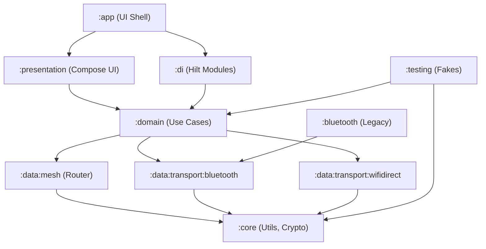
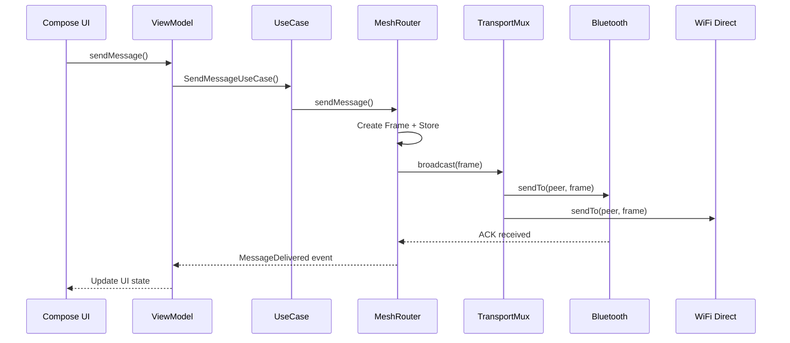
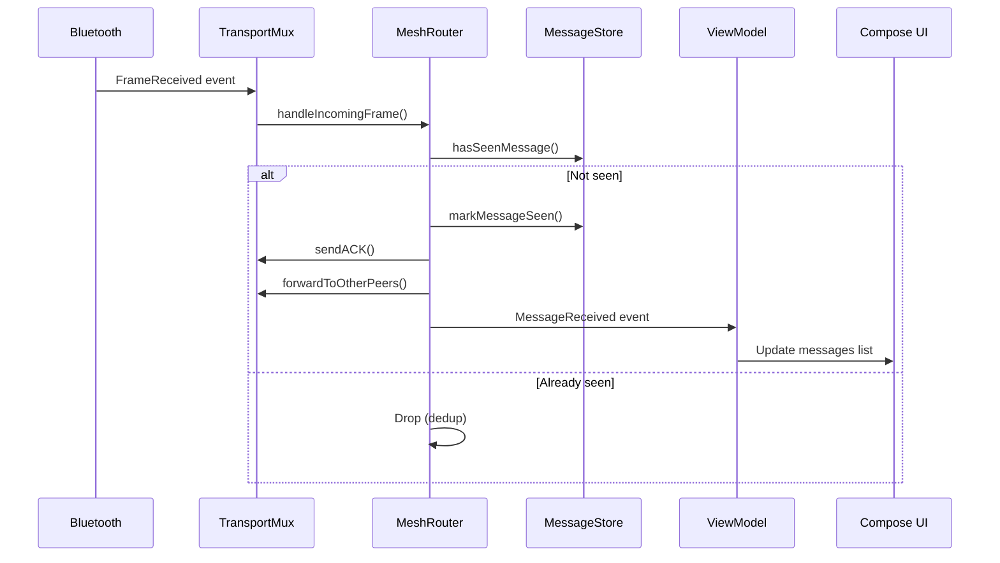

# HayatKurtar Mesh Network Architecture

## 🏗️ System Overview

HayatKurtar is an offline mesh networking application designed for emergency communication scenarios. The system enables Android devices to communicate without internet or cellular connectivity using Bluetooth Classic and Wi-Fi Direct technologies in a multi-hop mesh topology.

### Core Mission
Enable communication in disaster scenarios where traditional infrastructure is unavailable, allowing messages to propagate through a network of nearby devices to reach distant recipients.

## 🎯 Architecture Principles

### Clean Architecture
- **Separation of Concerns**: Clear boundaries between presentation, domain, and data layers
- **Dependency Inversion**: High-level modules don't depend on low-level modules
- **Single Responsibility**: Each module has one reason to change
- **Interface Segregation**: Clients depend only on interfaces they use

### SOLID Principles Implementation
- **S**: Each class has a single, well-defined responsibility
- **O**: Open for extension (new transport strategies) but closed for modification
- **L**: Substitutable implementations (FakeTransport for testing)
- **I**: Segregated interfaces (TransportStrategy, MeshRouter, MessageStore)
- **D**: Depend on abstractions, not concretions

## 📦 Module Architecture



### Module Responsibilities

#### `:core` - Foundation Layer
- **Common Utilities**: Result types, exception hierarchy
- **Cryptography**: X25519 key exchange, AES-GCM encryption, E2E encryption
- **Protocol**: Binary frame format, serialization/deserialization
- **Logging**: Offline file-based logging with rotation

#### `:domain` - Business Logic Layer
- **Entities**: MeshMessage, Peer, TransportEvent
- **Interfaces**: MeshRouter, TransportStrategy, MessageStore
- **Use Cases**: SendMessage, ConnectToPeer, GetMeshStats

#### `:data:mesh` - Mesh Implementation Layer
- **DefaultMeshRouter**: Flood routing with TTL, dedup, ACK, retry
- **RoomMessageStore**: Database-backed message storage with LRU cache
- **DefaultTransportMultiplexer**: Multi-transport orchestration

#### `:data:transport:*` - Transport Layer
- **BluetoothClassicTransportStrategy**: RFCOMM/SPP implementation
- **WiFiDirectTransportStrategy**: Wi-Fi P2P with TCP sockets
- **Transport-specific connection management and frame handling**

#### `:presentation` - UI Layer
- **Jetpack Compose screens**: Chat, permissions, E2E encryption
- **ViewModels**: State management and UI logic
- **Navigation**: Screen transitions and deep linking

## 🔄 Data Flow Architecture

### Message Sending Flow


### Message Receiving Flow


## 🌐 Mesh Networking Protocol

### Frame Format (Binary)
```
Offset | Size | Field          | Description
-------|------|----------------|----------------------------------
0      | 1    | version        | Protocol version (0x01)
1      | 1    | type           | Frame type (HELLO/CHAT/ACK/etc.)
2      | 16   | messageId      | UUID v4 (128-bit)
18     | 8    | originId       | Source device ID (64-bit)
26     | 1    | ttl            | Time-to-live (hop limit)
27     | 1    | hopCount       | Current hop count
28     | 1    | priority       | Message priority (0-2)
29     | 8    | timestamp      | Unix timestamp (64-bit)
37     | 2    | payloadLen     | Payload size (16-bit)
39     | N    | payload        | Message content
39+N   | 4    | crc32          | Frame integrity check
```

### Routing Algorithm

#### Controlled Flood with Optimizations
1. **Message Creation**: Generate unique MessageId (UUID v4)
2. **Deduplication**: Check MessageStore for previously seen messages
3. **TTL Management**: Decrement TTL on each hop, drop when TTL=0
4. **Hop Count**: Increment hop count for routing metrics
5. **Store-and-Forward**: Buffer messages for retry and ACK management

#### Reliability Mechanisms
- **Per-hop ACK**: Each hop acknowledges receipt
- **Exponential Backoff**: 500ms → 2s → 8s retry intervals
- **Priority Queuing**: HIGH (SOS) > NORMAL > LOW
- **Message Expiry**: 10-minute message lifetime

### Transport Selection Strategy

#### Smart Transport Choice
```kotlin
fun chooseBestTransport(peer: Peer, frame: Frame): TransportType {
    return when {
        frame.payload.size > 100 -> WIFI_DIRECT  // High bandwidth
        frame.priority == HIGH -> preferredTransport // Reliability
        else -> peer.transport                       // Default
    }
}
```

#### Connection Orchestration
1. **Multi-link Support**: Simultaneous Bluetooth + Wi-Fi Direct
2. **Automatic Fallback**: Wi-Fi Direct → Bluetooth on failure
3. **Link Quality**: RSSI-based quality assessment
4. **Connection Pooling**: Reuse existing connections

## 🔐 Security Architecture

### Multi-Layer Security

#### 1. Link-Layer Encryption (Mandatory)
- **Key Exchange**: X25519 Diffie-Hellman
- **Encryption**: AES-256-GCM with Tink
- **Session Management**: 15-minute key rotation
- **Per-Connection**: Each peer connection has unique session keys

#### 2. End-to-End Encryption (Optional)
- **Identity Keys**: Ed25519 key pairs per user
- **Key Distribution**: QR code sharing
- **Message Encryption**: Separate E2E layer on top of link encryption
- **Forward Secrecy**: Session keys derived from ECDH

#### 3. Security Properties
- **Confidentiality**: All communications encrypted
- **Integrity**: CRC32 + AEAD authentication
- **Non-repudiation**: Cryptographic signatures (E2E)
- **Perfect Forward Secrecy**: Session key rotation

## 🔋 Battery Optimization

### Adaptive Scanning Strategy
```kotlin
enum class BatteryOptimizationLevel {
    AGGRESSIVE,   // 60s intervals, minimal scanning
    NORMAL,       // 30s intervals, balanced approach
    PERFORMANCE   // 10s intervals, maximum connectivity
}
```

#### Dynamic Level Selection
- **No Connections**: AGGRESSIVE (save battery)
- **1-2 Connections**: NORMAL (balanced)
- **3+ Connections**: PERFORMANCE (maintain mesh)

#### Power Management
- **Foreground Service**: Persistent background operation
- **Partial Wake Lock**: CPU-only wakeup (10-minute chunks)
- **Duty Cycling**: Intermittent scanning periods
- **Connection Reuse**: Minimize reconnection overhead

## 🧪 Testing Architecture

### Multi-Level Testing Strategy

#### 1. Unit Tests
- **Frame Protocol**: Serialization, validation, CRC
- **Mesh Router**: Routing logic, deduplication, retry
- **Crypto**: Key exchange, encryption/decryption
- **Message Store**: Database operations, caching

#### 2. Integration Tests
- **FakeTransport**: Hardware-independent mesh simulation
- **Multi-hop Scenarios**: A→B→C routing validation
- **Network Partitions**: Resilience testing
- **Failure Recovery**: Reconnection and retry behavior

#### 3. Test Utilities
```kotlin
object MeshTestUtils {
    fun createThreeNodeMesh(): Triple<FakeTransport, FakeTransport, FakeTransport>
    fun waitForPropagation(delayMs: Long = 500)
    suspend fun simulateNetworkPartition(group1: Set<String>, group2: Set<String>)
}
```

## 📊 Performance Characteristics

### Latency Targets
- **Direct Connection**: < 1 second
- **2-Hop Routing**: < 3 seconds
- **3-Hop Routing**: < 5 seconds
- **Emergency Messages**: < 1 second (high priority)

### Throughput Expectations
- **Bluetooth Classic**: ~100 KB/s effective
- **Wi-Fi Direct**: ~1-10 MB/s effective
- **Message Size Limit**: 512 bytes payload (recommended)
- **Concurrent Connections**: 5 peers maximum

### Memory Usage
- **Message Cache**: LRU with 1000 entry limit
- **Seen Messages**: Bloom filter + database cleanup
- **Session Storage**: In-memory with TTL expiry
- **Log Files**: 2MB max, 3-file rotation

## 🔧 Configuration & Tuning

### Mesh Parameters
```kotlin
data class MeshConfig(
    val defaultTTL: Byte = 8,
    val messageExpiryMs: Long = 10 * 60 * 1000L,
    val maxRetryAttempts: Int = 3,
    val retryBackoffMs: Long = 500L,
    val maxConcurrentConnections: Int = 5,
    val scanIntervalMs: Long = 30_000L
)
```

### Transport Configuration
```kotlin
data class TransportConfig(
    val enableBluetoothClassic: Boolean = true,
    val enableWiFiDirect: Boolean = true,
    val connectionTimeoutMs: Long = 10_000L,
    val scanDurationMs: Long = 12_000L
)
```

## 🚀 Deployment Architecture

### Android Compatibility
- **Minimum SDK**: API 24 (Android 7.0)
- **Target SDK**: API 35 (Android 15)
- **Permissions**: Runtime permission handling for Android 12+
- **Hardware Requirements**: Bluetooth + Wi-Fi (Wi-Fi Direct optional)

### Production Considerations
- **Foreground Service**: Persistent notification required
- **Background Restrictions**: Optimized for Doze mode
- **Crash Recovery**: Service auto-restart
- **Memory Management**: Low-RAM device support

## 🔍 Monitoring & Diagnostics

### Real-time Metrics
- **Network State**: Connected peers, known routes
- **Message Counters**: Sent, received, forwarded, dropped
- **Transport Health**: Active transports, connection quality
- **Performance**: Latency, throughput, battery usage

### Debugging Support
- **Structured Logging**: File-based with log rotation
- **Network Topology**: Visual representation of mesh
- **Message Tracing**: End-to-end message journey
- **Error Reporting**: Comprehensive exception hierarchy

## 📈 Scalability Considerations

### Network Size Limits
- **Optimal Size**: 10-20 devices in local area
- **Maximum Size**: Limited by TTL and flooding overhead
- **Density**: High device density improves connectivity
- **Geographic**: ~100m radius per hop (device dependent)

### Future Enhancements
- **Routing Improvements**: AODV, DSR, or custom routing protocols
- **QoS**: Traffic prioritization and bandwidth allocation
- **Mesh Optimization**: Spanning tree overlay, cluster heads
- **Protocol Evolution**: Version negotiation and backward compatibility

## 🛡️ Security Considerations

### Threat Model
- **Passive Eavesdropping**: Mitigated by encryption
- **Active MITM**: Prevented by key verification
- **Denial of Service**: Rate limiting and peer reputation
- **Privacy**: No personal data transmitted to servers

### Best Practices
- **Key Management**: Secure key storage with Android Keystore
- **Session Hygiene**: Regular key rotation
- **Input Validation**: Robust frame parsing and validation
- **Error Handling**: No information leakage through errors

---

This architecture supports the core mission of enabling reliable, secure, and efficient communication in disaster scenarios while maintaining high code quality, testability, and maintainability standards.