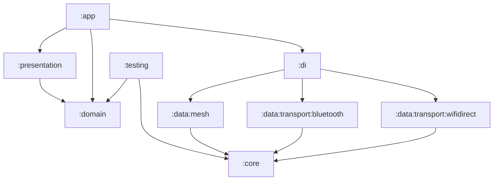
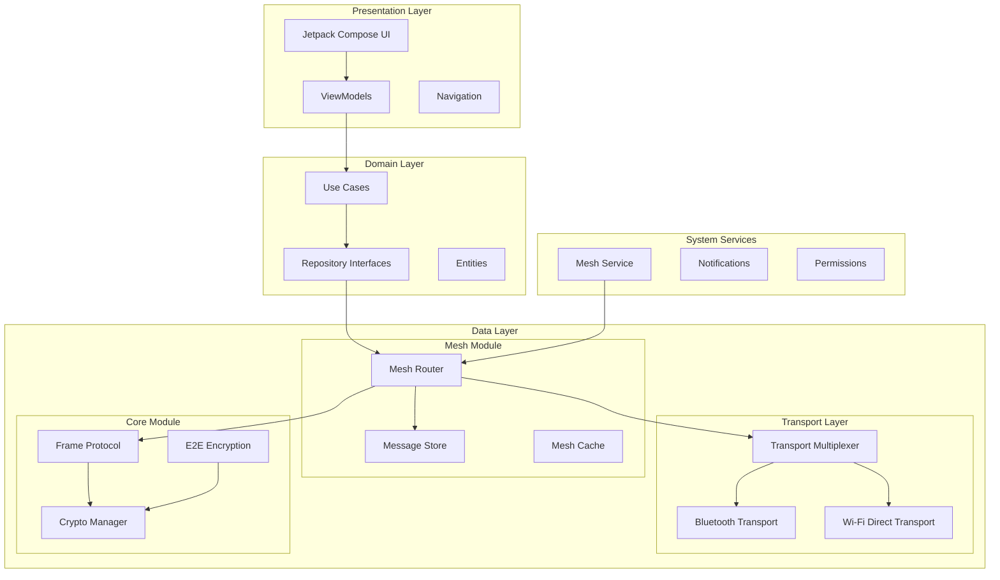
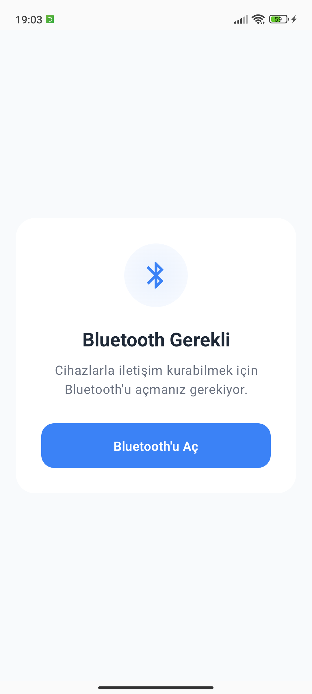
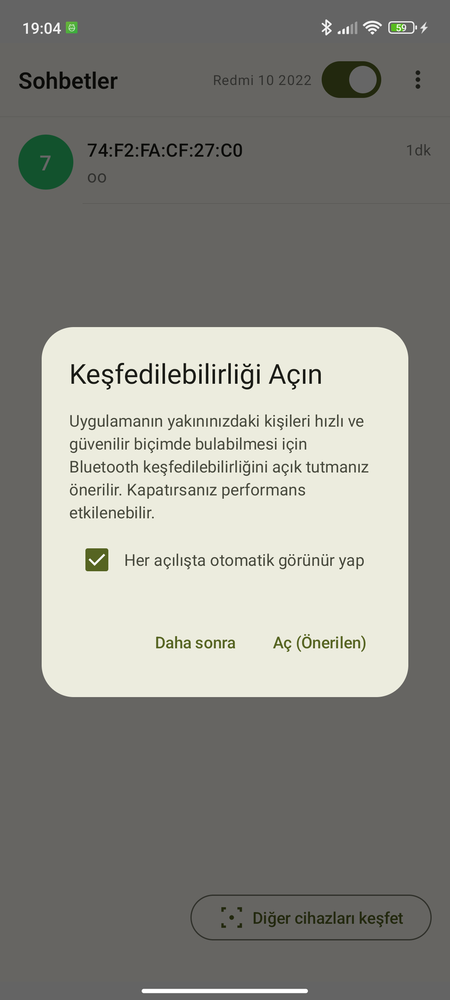
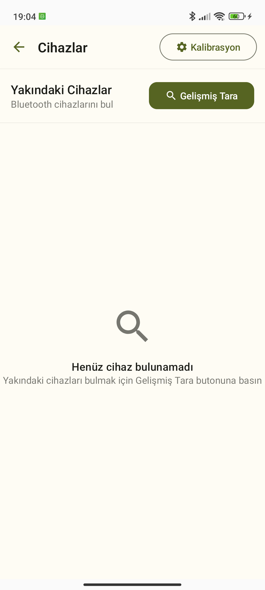
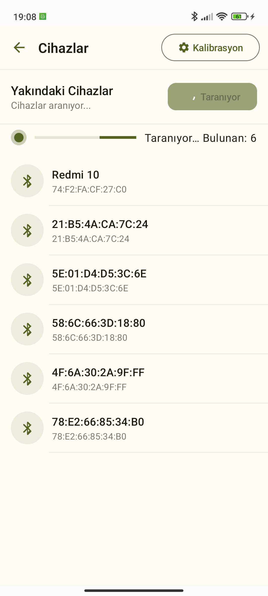

# HayatKurtar (Life Saver) - Offline Mesh Network Communication

**Emergency Communication System for Disaster Scenarios**

HayatKurtar is a comprehensive offline mesh networking application designed for emergency communication during disasters like earthquakes when traditional internet infrastructure fails. The app enables peer-to-peer communication through Bluetooth Classic and Wi-Fi Direct with multi-hop mesh routing capabilities.

## 🚀 Key Features

- **Offline Mesh Networking**: Multi-hop message routing without internet
- **Dual Transport**: Bluetooth Classic + Wi-Fi Direct simultaneous connections
- **End-to-End Encryption**: Ed25519/X25519 cryptographic security
- **Emergency SOS**: High-priority message broadcasting
- **Battery Optimized**: Adaptive scanning and foreground service
- **Store & Forward**: Messages relay through intermediate nodes
- **Clean Architecture**: Modular design following SOLID principles

## 🛠 Technology Stack

- **Languages**: Kotlin 1.9.22, Java 17
- **Build**: AGP 8.2.1, Gradle 8.2.1
- **Framework**: Jetpack Compose, Material Design 3
- **Architecture**: Clean Architecture, Multi-Module, Hilt DI
- **Database**: Room with migration support
- **Async**: Coroutines, Flow
- **Security**: X25519/AES-GCM, Ed25519, Tink Crypto
- **Transport**: Bluetooth Classic (RFCOMM), Wi-Fi Direct (TCP)

## 🚀 Quick Start

### Prerequisites

- Android 7.0+ (API 24+)
- Bluetooth and Wi-Fi capabilities
- Location permission for Wi-Fi Direct discovery

### Build & Install

```bash
# Clone the repository
git clone https://github.com/appvalence/hayatkurtar.git
cd hayatkurtar

# Build the application
./gradlew clean assembleDebug

# Install on device
adb install app/build/outputs/apk/debug/app-debug.apk
```

### First Time Setup

1. **Grant Permissions**: Allow Bluetooth, Wi-Fi, and Location permissions
2. **Enable Services**: Turn on Bluetooth and Wi-Fi
3. **Start Mesh Service**: App automatically starts background mesh service
4. **Discover Peers**: Tap "Scan Devices" to find nearby participants
5. **Send Messages**: Select a contact and start chatting

### Emergency SOS

- Long press the send button to broadcast SOS messages
- SOS messages have highest priority and wider broadcast radius
- All nearby devices will receive and relay SOS messages

## 🏗 Architecture Overview

HayatKurtar follows Clean Architecture principles with a multi-module structure:

```
:app (presentation layer)
├── :presentation (UI, ViewModels, Navigation)
├── :domain (Use Cases, Entities, Repository Interfaces)
└── :di (Dependency Injection)

:data (data layer)
├── :data:mesh (Mesh Router, Message Store)
├── :data:transport:bluetooth (Bluetooth Classic Transport)
├── :data:transport:wifidirect (Wi-Fi Direct Transport)
└── :core (Shared utilities, Protocol, Crypto)

:testing (Test utilities and mocks)
```

### Module Dependencies



### Key Components

- **MeshRouter**: Core routing engine with flood + TTL algorithm
- **TransportMultiplexer**: Manages multiple transport strategies
- **MessageStore**: Persistent storage with deduplication
- **CryptoManager**: E2E encryption and link-layer security
- **MeshService**: Background service for continuous operation

## 📱 Permissions & Compatibility

### Required Permissions

**Android 12+ (API 31+)**
- `BLUETOOTH_SCAN` (neverForLocation)
- `BLUETOOTH_CONNECT`
- `BLUETOOTH_ADVERTISE`
- `NEARBY_WIFI_DEVICES` (neverForLocation)

**Android 11 and below**
- `BLUETOOTH` + `BLUETOOTH_ADMIN`
- `ACCESS_FINE_LOCATION` (for Wi-Fi Direct)
- `ACCESS_WIFI_STATE` + `CHANGE_WIFI_STATE`

**Service Permissions**
- `FOREGROUND_SERVICE`
- `FOREGROUND_SERVICE_CONNECTED_DEVICE`
- `WAKE_LOCK`

### Runtime Permission Handling

The app includes a comprehensive permission gate that requests permissions progressively and explains their necessity for emergency communication.

## 🧪 Testing

### Unit Tests

```bash
# Run all unit tests
./gradlew test

# Test specific modules
./gradlew :core:test
./gradlew :data:mesh:test
./gradlew :data:transport:bluetooth:test
```

### Integration Tests

```bash
# Run integration tests with FakeTransport
./gradlew :testing:test
```

### Test Coverage

- **Frame Protocol**: Serialization, CRC validation, version compatibility
- **Mesh Router**: Routing algorithms, TTL handling, deduplication
- **Transport Strategies**: Connection management, data transmission
- **Crypto**: Key exchange, encryption/decryption, security protocols
- **E2E Scenarios**: Multi-hop routing, store & forward, mesh healing

### Test Utilities

The `:testing` module provides:
- `FakeTransportStrategy` for hardware-independent testing
- `TestMeshNetwork` for simulating mesh topologies
- Mock implementations for unit testing

## 🔐 Security Features

### Link-Layer Security
- **X25519 Key Exchange**: Secure key establishment between peers
- **AES-GCM Encryption**: Authenticated encryption for all mesh traffic
- **Frame Authentication**: CRC32 + MAC validation

### End-to-End Security
- **Ed25519 Identity Keys**: Long-term identity authentication
- **X25519 Session Keys**: Perfect forward secrecy
- **QR Code Sharing**: Secure key distribution via visual channel
- **Contact Verification**: Identity key fingerprint verification

### Key Management
- **Android Keystore**: Hardware-backed key protection
- **Tink Crypto Library**: Google's cryptographic library
- **Key Rotation**: Automatic session key refresh
- **Secure Deletion**: Memory clearing for sensitive data

---

## :bluetooth Modülü

Modül, tekrar kullanılabilir Bluetooth API'leri ve Android implementasyonlarını içerir.

### Paketler

- `com.appvalence.bluetooth.api`: `BluetoothController`, `HighPerformanceScanner`, `BleAdvertiser`, `DistanceEstimator`, `DiscoveredDevice`
- `com.appvalence.bluetooth.impl`: `AndroidBluetoothController`, `AndroidHighPerformanceScanner`, `AndroidBleAdvertiser`, `RssiDistanceEstimator`
- `com.appvalence.bluetooth.di`: `BluetoothModule` (Hilt provider’ları)

### Kullanım (App tarafı)

1) Gradle bağımlılığı (bu repo içindeyseniz):

```kotlin
dependencies {
    implementation(project(":bluetooth"))
}
```

2) Hilt ile enjekte etme:

```kotlin
@AndroidEntryPoint
class SomeViewModel @Inject constructor(
    private val controller: com.appvalence.bluetooth.api.BluetoothController,
) : ViewModel() { /* ... */ }
```

3) Servisler app katmanında kalmalı (bildirim, ikon, izin ve foreground policy gereği). `BluetoothModule` implementasyon sağlayıcısıdır, app sadece API’leri tüketir.

### Mimari İlkeler

- API/Impl ayrımı: UI veya veri katmanına sızdırmadan port/adapter modeli
- DI sınırı modülde: app’in DI grafiğine implementasyonları ekler
- Test edilebilirlik: API’ler için fake/mock implementasyon kolay

## 📡 Usage Examples

### Basic Mesh Communication

```kotlin
@HiltViewModel
class ChatViewModel @Inject constructor(
    private val meshRouter: MeshRouter,
    private val meshService: MeshService
) : ViewModel() {

    fun sendMessage(content: String, isEmergency: Boolean = false) {
        viewModelScope.launch {
            val priority = if (isEmergency) Priority.EMERGENCY else Priority.NORMAL
            val result = meshRouter.sendMessage(
                content = content.toByteArray(),
                priority = priority,
                ttl = if (isEmergency) 10 else 5
            )
            
            when (result) {
                is MeshResult.Success -> {
                    // Message queued for transmission
                }
                is MeshResult.Error -> {
                    // Handle error
                }
            }
        }
    }

    fun observeIncomingMessages() {
        meshRouter.events
            .filterIsInstance<MeshEvent.MessageReceived>()
            .onEach { event ->
                // Process incoming message
                val message = event.message
                // Update UI
            }
            .launchIn(viewModelScope)
    }
}
```

### E2E Encrypted Communication

```kotlin
@HiltViewModel
class SecureChatViewModel @Inject constructor(
    private val e2eManager: E2EEncryptionManager
) : ViewModel() {

    fun sendEncryptedMessage(contactId: String, content: String) {
        viewModelScope.launch {
            val result = e2eManager.encryptMessage(
                contactId = contactId,
                plaintext = content.toByteArray()
            )
            
            when (result) {
                is MeshResult.Success -> {
                    // Send encrypted message through mesh
                }
                is MeshResult.Error -> {
                    // Handle encryption error
                }
            }
        }
    }
    
    fun shareIdentityKey(): String {
        return e2eManager.exportIdentityKeyQR()
    }
}
```

### Transport Management

```kotlin
@Service
class MeshService : Service() {
    
    @Inject
    lateinit var transportMultiplexer: TransportMultiplexer
    
    override fun onCreate() {
        super.onCreate()
        
        // Start both Bluetooth and Wi-Fi Direct
        lifecycleScope.launch {
            transportMultiplexer.start(
                enableBluetooth = true,
                enableWiFiDirect = true
            )
        }
        
        // Monitor network state
        transportMultiplexer.networkEvents
            .onEach { event ->
                when (event) {
                    is NetworkEvent.PeerConnected -> {
                        // Handle new peer
                    }
                    is NetworkEvent.PeerDisconnected -> {
                        // Handle peer loss
                    }
                }
            }
            .launchIn(lifecycleScope)
    }
}
```

## 🚨 Emergency Features

### SOS Broadcasting

- **Automatic Relay**: All devices automatically relay SOS messages
- **Extended Range**: SOS messages use maximum TTL (10 hops)
- **Priority Handling**: SOS messages bypass normal queuing
- **Persistent Storage**: SOS messages stored until acknowledged

### Disaster Mode

- **Power Saving**: Reduced scanning frequency to preserve battery
- **Store & Forward**: Messages cached for up to 24 hours
- **Auto-Discovery**: Continuous peer discovery for network healing
- **Emergency Contacts**: Priority delivery to designated contacts

## 📊 Performance Characteristics

### Throughput
- **Text Messages**: ~100-500 messages/minute per device
- **Small Files**: 1-10 MB through multi-hop relay
- **Network Latency**: 100ms-2s depending on hop count

### Scalability
- **Network Size**: Tested up to 50 devices
- **Message Queue**: 1000+ pending messages per device
- **Memory Usage**: ~50-100 MB baseline, ~200 MB under load

### Battery Impact
- **Background Mode**: ~5-10% battery per hour
- **Active Communication**: ~15-25% battery per hour
- **Wi-Fi Direct**: 2-3x more battery than Bluetooth Classic

## 📈 System Architecture Diagram



---

## Yayınlama (Publishing)

Modül Maven artifact olarak yayımlanabilir. Varsayılan olarak `mavenLocal()` ve (varsa) OSSRH (Sonatype) için yapılandırma içerir.

### Versiyon ve Grup

- `bluetooth/build.gradle.kts` içinde:
  - `group = "com.appvalence"`
  - `version = "0.1.0"`

### Komutlar

```bash
# Yerel Maven'e yayınla
./gradlew :bluetooth:publishToMavenLocal

# Sonatype’a (OSSRH) yayınla – kimlik bilgileri gerekir
export OSSRH_USERNAME=... && export OSSRH_PASSWORD=...
./gradlew :bluetooth:publish
```

Snapshots için `version` sonuna `-SNAPSHOT` ekleyin; betik snapshot deposuna yayınlar.

### POM bilgisi

`bluetooth/build.gradle.kts` içinde ad, açıklama, lisans ve SCM bilgileri doldurulmuştur. Gerektiğinde güncelleyiniz.

---

## Neden Bu Tasarım?

- Açık kaynak katkı: Bluetooth katmanı bağımsız ve yeniden kullanılabilir
- Clean Architecture: UI/presentation, domain ve data ayrımı; altyapı (Bluetooth) modüler
- Genişletilebilirlik: İlerde `bluetooth-mock`, `ble-only` gibi varyant modüller eklemek kolay


| perm | home | devcs |
|:-:|:-:|:-:|
|  |  |  |
| disc | search | post |
|  |  |  
|