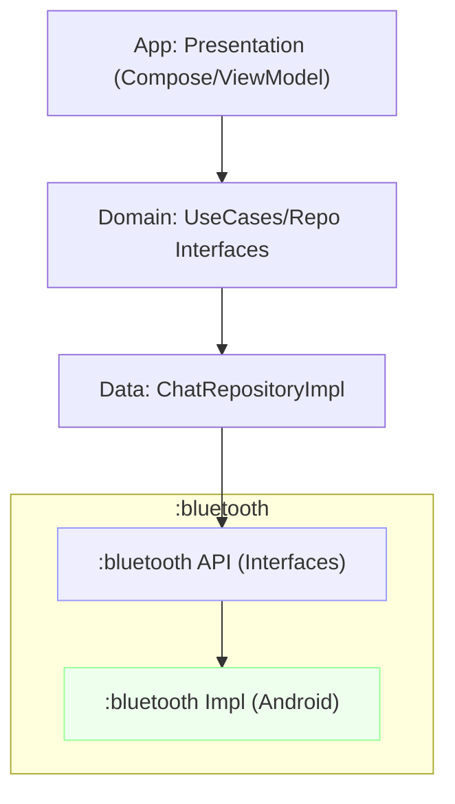

# HayatKurtar (Offline Bluetooth Chat)

- Kotlin 1.9.22, AGP 8.2.1, Gradle 8.2.1, Java 17
- Jetpack Compose, Hilt, Room, Coroutines, Navigation
- Offline Bluetooth (classic + BLE placeholder), AES-GCM via Tink, X25519 DH

## Build

```bash
./gradlew clean assembleDebug
```

Android Studio ile açıp çalıştırabilirsiniz.

## Mimari

- presentation (app): Compose ekranları, ViewModel, Navigation
- domain (app): entity, repository interface, use-case
- data (app): repository implementasyonu, crypto, room, service
- bluetooth (module): Bluetooth port/interface'ler (API) ve Android implementasyonları

Katman bağımlılıkları: `app → bluetooth`. App, bluetooth modülündeki arayüzleri enjekte eder; uygulamaya özel servis ve UI app modülünde kalır.

## İzinler

Manifest içinde Android 12+ ve altı için gerekli Bluetooth/konum izinleri eklidir. Runtime izin isteme (UI) örneği basit tutulmuştur.

## Test

```bash
./gradlew test
```

- `SendMessageUseCaseTest` temel delege davranışını doğrular (Bluetooth mock'lu yaklaşım).

## Notlar

- Demo amaçlı Bluetooth tarama/bağlantı ve mesajlaşma akışı minimal tutuldu, gerçek cihazda GATT/RFCOMM akışı eklenmelidir.
- AES-GCM için Tink kullanılır; anahtarlar Android Keystore ile korunur.

---

## :bluetooth Modülü

Modül, tekrar kullanılabilir Bluetooth API'leri ve Android implementasyonlarını içerir.

### Paketler

- `com.appvalence.bluetooth.api`: `BluetoothController`, `HighPerformanceScanner`, `BleAdvertiser`, `DistanceEstimator`, `DiscoveredDevice`
- `com.appvalence.bluetooth.impl`: `AndroidBluetoothController`, `AndroidHighPerformanceScanner`, `AndroidBleAdvertiser`, `RssiDistanceEstimator`
- `com.appvalence.bluetooth.di`: `BluetoothModule` (Hilt provider’ları)

### Kullanım (App tarafı)

1) Gradle bağımlılığı (bu repo içindeyseniz):

```kotlin
dependencies {
    implementation(project(":bluetooth"))
}
```

2) Hilt ile enjekte etme:

```kotlin
@AndroidEntryPoint
class SomeViewModel @Inject constructor(
    private val controller: com.appvalence.bluetooth.api.BluetoothController,
) : ViewModel() { /* ... */ }
```

3) Servisler app katmanında kalmalı (bildirim, ikon, izin ve foreground policy gereği). `BluetoothModule` implementasyon sağlayıcısıdır, app sadece API’leri tüketir.

### Mimari İlkeler

- API/Impl ayrımı: UI veya veri katmanına sızdırmadan port/adapter modeli
- DI sınırı modülde: app’in DI grafiğine implementasyonları ekler
- Test edilebilirlik: API’ler için fake/mock implementasyon kolay

---

## API Örnekleri

### 1) Cihaz Tarama (Classic + BLE)

```kotlin
@HiltViewModel
class DevicesViewModel @Inject constructor(
    private val scanner: com.appvalence.bluetooth.api.HighPerformanceScanner
) : ViewModel() {

  private val _devices = MutableStateFlow<List<com.appvalence.bluetooth.api.DiscoveredDevice>>(emptyList())
  val devices: StateFlow<List<com.appvalence.bluetooth.api.DiscoveredDevice>> = _devices.asStateFlow()

  fun startScan() {
    viewModelScope.launch {
      scanner.startScan().collect { d ->
        _devices.update { it + d }
      }
    }
  }

  fun stopScan() {
    viewModelScope.launch { scanner.stopScan() }
  }
}
```

### 2) Bağlanma, Mesaj Gönderme/Alma

```kotlin
@HiltViewModel
class ChatViewModel @Inject constructor(
    private val controller: com.appvalence.bluetooth.api.BluetoothController
) : ViewModel() {

  val connected: StateFlow<Boolean> = controller
    .observeConnectionState()
    .stateIn(viewModelScope, SharingStarted.Lazily, false)

  val incoming: StateFlow<String> = controller
    .incoming()
    .map { bytes -> bytes.decodeToString() }
    .stateIn(viewModelScope, SharingStarted.Lazily, "")

  fun connect(address: String) = viewModelScope.launch {
    controller.connect(address)
  }

  fun disconnect() = viewModelScope.launch { controller.disconnect() }

  fun send(text: String) = viewModelScope.launch {
    controller.send(text.encodeToByteArray())
  }
}
```

### 3) BLE Advertising (Görünürlük)

```kotlin
@HiltViewModel
class VisibilityViewModel @Inject constructor(
    private val advertiser: com.appvalence.bluetooth.api.BleAdvertiser
) : ViewModel() {
  private val _isAdvertising = MutableStateFlow(false)
  val isAdvertising: StateFlow<Boolean> = _isAdvertising.asStateFlow()

  fun enable() { _isAdvertising.value = advertiser.start() }
  fun disable() { advertiser.stop(); _isAdvertising.value = false }
}
```

### 4) Mesafe Tahmini (RSSI/TxPower)

```kotlin
class DistanceFeature @Inject constructor(
  private val estimator: com.appvalence.bluetooth.api.DistanceEstimator
) {
  fun calibrate() {
    estimator.updateCalibration(
      measuredPowerDefault = -59,
      pathLossExponent = 2.2,
      smoothingAlpha = 0.4
    )
  }

  fun estimate(address: String, rssi: Int?, tx: Int?): Double? =
    estimator.estimateDistanceMeters(address, rssi, tx)
}
```

Not: Gerekli Bluetooth izinleri ve runtime izin akışları app modülünde yönetilmelidir.

---

## Mimari Diyagram



---

## Yayınlama (Publishing)

Modül Maven artifact olarak yayımlanabilir. Varsayılan olarak `mavenLocal()` ve (varsa) OSSRH (Sonatype) için yapılandırma içerir.

### Versiyon ve Grup

- `bluetooth/build.gradle.kts` içinde:
  - `group = "com.appvalence"`
  - `version = "0.1.0"`

### Komutlar

```bash
# Yerel Maven'e yayınla
./gradlew :bluetooth:publishToMavenLocal

# Sonatype’a (OSSRH) yayınla – kimlik bilgileri gerekir
export OSSRH_USERNAME=... && export OSSRH_PASSWORD=...
./gradlew :bluetooth:publish
```

Snapshots için `version` sonuna `-SNAPSHOT` ekleyin; betik snapshot deposuna yayınlar.

### POM bilgisi

`bluetooth/build.gradle.kts` içinde ad, açıklama, lisans ve SCM bilgileri doldurulmuştur. Gerektiğinde güncelleyiniz.

---

## Neden Bu Tasarım?

- Açık kaynak katkı: Bluetooth katmanı bağımsız ve yeniden kullanılabilir
- Clean Architecture: UI/presentation, domain ve data ayrımı; altyapı (Bluetooth) modüler
- Genişletilebilirlik: İlerde `bluetooth-mock`, `ble-only` gibi varyant modüller eklemek kolay


